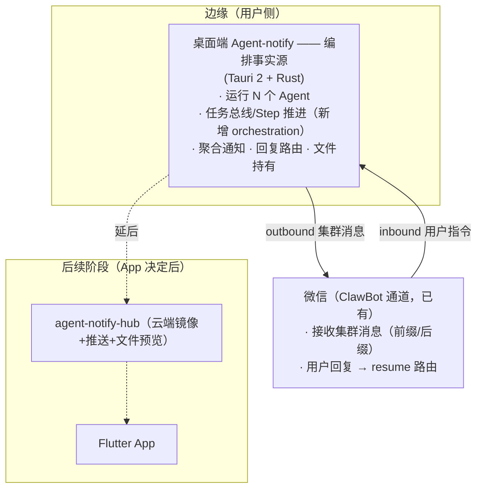
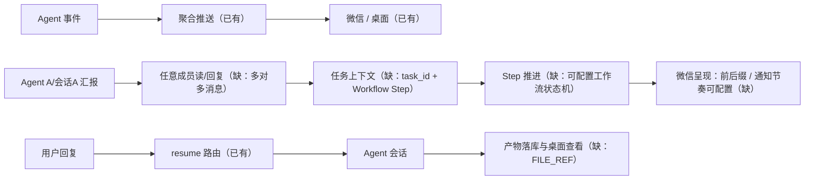
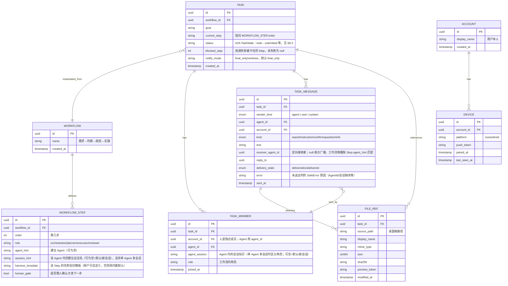
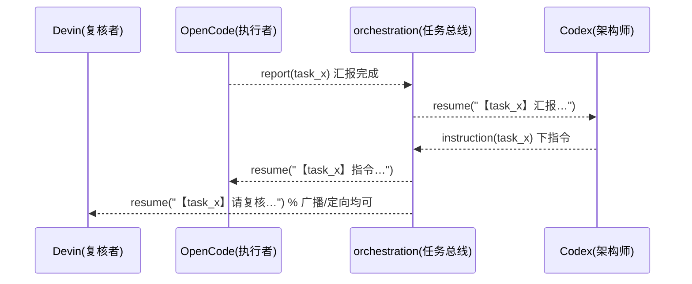
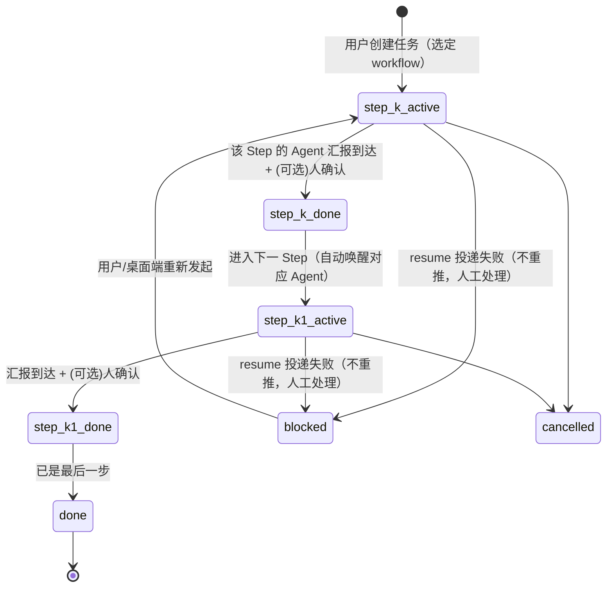
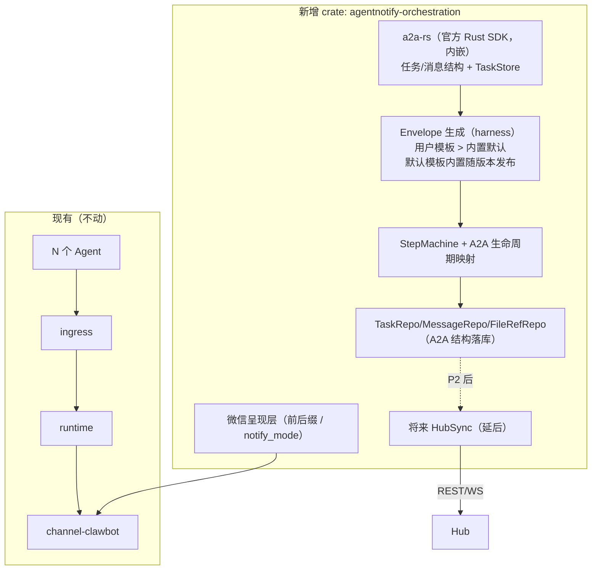
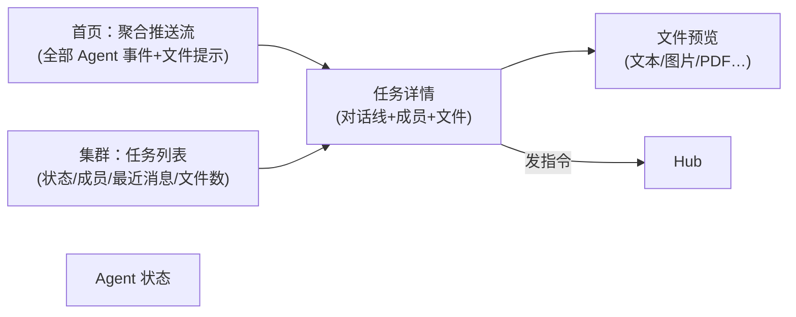
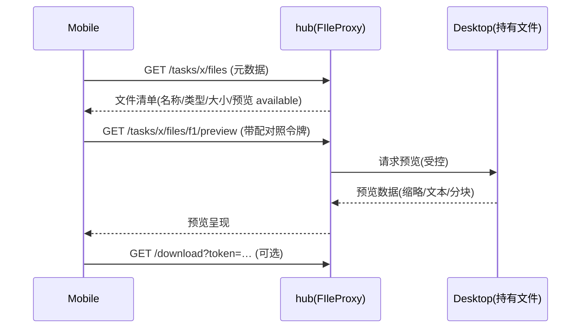

# Agent-notify 集群版架构设计

> 状态：草案 v0.6（待评审）· 对应终极目标：手机聚合多 Agent 推送 + 多 Agent 协同干活 + 手机上看到 Agent 的文件成果
> 基线：Agent-notify 2.0.x（Tauri 桌面端 + 5 个 Agent + ClawBot 微信通道）
> v0.5 决策：起步阶段**不做 App / 不建 hub**，集群全部经现有微信通道触达——纯桌面端增量；App/hub/文件预览延后为后续阶段。
> v0.5 追加：通知节奏可配置（默认只推最顶层最终汇报，可切逐步流转）· harness 用户可配置 + 内置默认兜底 · 节点自由选 Agent（可复用同一 Agent）。
> v0.6（本轮）：按公开资料遍历 A2A v1.0 官方规范与 Rust SDK，确认"拿来用 vs 自己造"边界，并补齐会话创建语义。

---

## 0. 需求清单（本设计的锚点，回归验收用它）

用户侧需求的完整清单，任何一版实现都要能对应回来，避免遗漏：

| # | 需求 | 落点 |
|---|---|---|
| R1 | 手机/微信聚合多个 Agent 的推送，能看到集群状态 | §1.1 / §4.6 / §6 |
| R2 | 多 Agent 协同干活：Codex 判断、OpenCode 规划、CommandCode 实施，汇报→指令闭环 | §3.1 / §4 |
| R3 | 不局限两个 Agent——任意 Agent 之间可互发消息（多对多） | §3.1 / §4.2 |
| R4 | 人在手机上能看 Agent 产出文件（不只文字） | §1.1 / §6.3 |
| R5 | 可配置工作流：按"需求→判断→规划→实施→汇报"的接力（参考子代理派发，agent 之间） | §3.1.1 |
| R6 | 集群消息带前缀 + 后缀 | §4.6 |
| R7 | 只推最顶层 Agent 最终汇报（默认），可切逐步流转 | §4.6 |
| R8 | 某节点不可用/投递失败：写明哪步失败、谁不可用、未送达，不自动重推，任务 blocked | §4.6 |
| R9 | 人的指令入口：微信回复 + 桌面端双支持（App 为后续退出路径） | §9 D-入口 |
| R10 | 每步的 harness（角色边界）用户可配置，内置默认兜底 | §4.3 |
| R11 | 节点自由选 Agent，允许复用同一 Agent（单 Agent 多会话），用户不感知会话 | §3.1 / D11 |
| R12 | 起步不另起 App/不建 hub，先用微信；App 是因微信受限才做的退出路径 | §1.3 / §6 / §7 |
| R13 | 能主动发起 Agent 干活（创建会话），不只续聊既有会话 | §3.3（新增） |
| R14 | 优先复用现有开放协议，不重复造轮子 | §8 |
| R15 | 文件触达（桌面端可看，走微信受附件限制待评估） | §11 开放问题 4 |

---

## 1. 目标、边界与分层

### 1.1 目标

> 长期目标如下；**起步阶段（P0/P1）只做桌面端 + 微信触达**，App/hub/文件预览全部延后（见 §10）。

1. **移动端承载**：iOS/Android App，接收 Agent 事件推送、查看集群状态、查看 Agent 产出**文件**、发指令给集群。
2. **Agent 编排（多对多）**：任意数量的 Agent 按角色协同完成"任务"——不只 Codex/OpenCode 两两，而是**任意 Agent 之间可互发消息**，任务内可按角色分配多个参与者（架构师 / 执行者 / 复核者…），**人**也是任务成员之一。
3. **文件触达**：Agent 在干活中产出的文件（diff、设计文档、报告、图表…）可以被用户在手机上浏览/预览/下载，而不只是"收到一句话通知"。

### 1.2 非目标（本设计不做）

- 不在手机端运行 Agent（干活端始终是桌面 / Agent 所在机器）。
- 不引入通用 Agent 框架、不替换现有 5 个 Agent 实现。
- 不破坏 Agent-notify 2.x 的既有通知、回复路由、登录与更新链路（向后兼容为硬约束）。
- 不做完整网盘：文件本体留在桌面端/Agent 侧，云端只做**受控预览**（见 §8.5）。

### 1.3 基本分层



> **v0.5 起步形态**：无 hub、无 App，全靠桌面端 + 微信双向通道。hub/App/文件预览作为后续阶段（§6/§7 保留设计，不进 P0/P1）。

---

## 2. 现状盘点（设计必须长在现有代码上）

### 2.1 已有的能力

| 能力 | 代码落点 | 说明 |
|---|---|---|
| 多 Agent 接入 | `crates/agentnotify-agent-*` | Codex / OpenCode / Devin / Antigravity / Command Code（可继续扩） |
| Agent 适配器契约 | `agent-sdk/adapter.rs` `AgentAdapter` | `parse_event` 标准化事件；`resume(session_id, text)` **现成的消息通道** |
| 统一事件入口 | `hosts/desktop-tauri/src/production/` | ingress/events 各 Agent 事件唯一边界 |
| 运行时调谐 | `crates/agentnotify-runtime` | worker 消费事件、投递、状态刷新 |
| 存储 | `crates/agentnotify-storage-sqlite` | SQLite：会话、投递、通知历史 |
| 渠道契约 | `channel-sdk/adapter.rs` | `OutboundMessage` + `ChannelAdapter.send` + `DeliveryReceipt` |
| 双向通道 | `crates/agentnotify-channel-clawbot` | Agent ↔ 微信：通知外发、回复入站路由 |
| 登录/配对 | 桌面端二维码登录 | 成熟模式，复用到设备配对 |

### 2.2 差距（本设计补齐）



---

## 3. 核心概念与数据模型

### 3.1 设计取向：消息总线 + 角色 + **可配置工作流**，而非"两两配对"

- **不写死谁跟谁通信**。编排层只维护 **任务（TASK）+ 成员（MEMBERS）+ 消息（MESSAGE）+ 文件（FILE_REF）+ 工作流（WORKFLOW）**。
- 任何成员（Agent 或人）都能向**任务内任意成员**发消息；消息按 `kind` 分类（汇报/指令/确认/提问/信息）。
- **角色（role）** 是任务内的本地属性（架构师 / 执行者 / 复核者…），随任务分配，不绑定 Agent 全局身份。
- **人（user）** 是任务的隐式成员：移动 App / 微信发指令都作为"人"的消息进入任务。
- **工作流 = 用户可配置的阶段流水线**（核心新增）：用户定义"任务按哪些阶段推进、每阶段由哪个角色/Agent 干、产出什么"。参照 Agent 内部"派子代理"的接力逻辑，但发生在 **Agent 之间**。
- **编排与 Agent 数量解耦**：同一套编排既支持**多 Agent 多角色**，也支持**单 Agent 复用**——用户编辑 Workflow 时**每个节点自由选 Agent，允许选同一个**（如第一步选 OpenCode、第二步也选 OpenCode）。用户不需要理解"会话"：编排层自动让同一 Agent 在不同 Step 使用互相隔离的上下文（`resume(session_id, …)` 天然按会话路由），避免相邻 Step 串味。

### 3.1.1 可配置工作流（Workflow）

```
用户提出需求
   │
   ▼  阶段1 role=orchestrator（Codex，或其会话A）─ 初步判断/可行性
   │
   ▼  阶段2 role=planner（OpenCode，或其会话B）── 规划整理/拆解方案
   │
   ▼  阶段3 role=executor（CommandCode，或其会话C）─ 实施
   │
   ▼  阶段4（可选）role=reviewer ─────── 复核/汇总
   │
   ▼  完成
```

> 注：阶段 1–3 是预置工作流，阶段 4 为可选复核（Workflow 配置项，默认关闭）。用户编辑时每个节点只选「角色 + Agent」，**允许重复选同一 Agent**——编排层自动为同一 Agent 的不同 Step 隔离会话，用户无需感知"会话"概念。

- **Workflow 定义**（用户配置，可多套）：`Workflow = [ Step{role, agent, harness 模板, 人工确认门} × N ]`，其中每步的 **harness 模板用户可自定义**（默认值兜底，见 §4.3）。
- **Task 实例**：引用一个 workflow 定义，各 Step 已就绪时（前置阶段 confirm）自动将下一步通知给对应 Agent（同一 Agent 复用则用隔离会话）——**等同"子代理接力"，跨 Agent 或跨会话**。
- 中间不搞复杂编排：每个 Step 只有「开工通知 → 该 Agent 在原生会话里干活 → 汇报 → （必要时人确认）→ 进入下一 Stage」。
- **会话是编排层细节，用户不感知**：Node 配置里只有 `agent_hint`（选谁）；同一 Agent 被多个 Step 选中时，编排层按 Step 新建/复用隔离会话上下文。`session_hint` 属高级可选（默认留空）。

按你给的默认示例，第一套预置 Workflow 即为：
- 多 Agent：`需求 → Codex 判断 → OpenCode 规划 → CommandCode 实施 → 汇报`
- 只用 OpenCode：`需求 → OpenCode(判断) → OpenCode(规划) → OpenCode(实施) → 汇报`——用户只是每一步都选 OpenCode，其余由编排层兜底

### 3.2 新增实体



- **WORKFLOW_STEP**：Workflow 的唯一阶段来源（`WORKFLOW.steps` 不另存集合，避免双份）；`TASK.current_step` 挂其 `order`。`session_hint` 为高级可选：留空时编排层为同一 Agent 的不同 Step 自动隔离会话。
- **ACCOUNT**：h**ub 账户** = 用户本人（与既有「渠道账号」语义区分：渠道账号是每个 Agent 的登录凭据，hub 账户是移动端配对的唯一身份）。
- **TASK_MEMBER**：Agent 成员用 `agent_id` + 可选 `agent_session`；人是隐式成员（`account_id`，可为空表示沿用任务创建者）。`agent_session` 默认由编排层按 Step 自动分配（隔离上下文），用户无需手动管理。
- **TASK_MESSAGE.sender_kind** + `agent_id`/`account_id`：单发送方语义，避免"挂两个 FK 选一"。
- **FILE_REF 双挂**：`TASK`（任务产物库）与 `TASK_MESSAGE`（某条消息的附件）都引用——汇报时产物自动进任务产物库，不因消息删除而丢失。
- **与 A2A 的关系（协议层用 `a2a-rs`，本表是本地仓储视图）**：`TASK.status` 取 A2A `TaskState`（含 `waiting_report`≈`input-required`、`blocked`≈`failed`），`TASK_MESSAGE` 的文本/附件最终以 A2A `Message.parts` 存取（§8.3）。即本表为"本地持久化视图"，协议结构与 A2A 一一对应，不建第二套事实源。

---

## 3.3 会话创建语义（R13：能主动发起 Agent 干活吗）

**结论：能，且不用自己造**。A2A v1.0 原生区分两种交互：

| A2A 操作 | 语义 | 对应我们的场景 |
|---|---|---|
| **`SendMessage`（无 taskId，创建新 Task）** | 向 Agent 发起**新任务** = 新会话 | Workflow 每个 Step 的"开工"（编排层主动让 OpenCode 干判断/规划） |
| `SendMessage`（带 taskId / contextId） | **续聊**既有任务/会话 | 人对某 Step 的回复、同会话多轮 |

- A2A 的 **contextId** = 逻辑会话（可关联多个 Task）；**taskId** = 单个工作单元。这正是"新会话 vs 续聊"的官方语义，无需自造会话引擎。
- 现状代码 `inbox.resume(session_id, text)` 只覆盖"续聊既有 OpenCode 会话"；**编排层需要补"A2A `SendMessage` 发起新 Task"的落地**——即让 OpenCode 插件支持"以新会话开工"（`open=true` 语义），这是 P0 的实际增量之一（工作量在插件侧，很小）。
- 起步：Agents 仍各自持有自己的真实会话/上下文（OpenCode 的 session、Codex 的 conversation）；编排层通过 A2A 语义决定"新开 vs 续聊"，**不复制会话内容**。

---

## 4. Agent 编排设计（核心）

### 4.1 设计原则

1. **消息总线而非点对点**：编排层维护任务内消息路由；发送方只声明 `kind + receiver(或 all)`，由任务成员解析目标——新增 Agent 只改成员表，不改路由代码。
2. **复用 `resume` 作为送达通道**：落库后经现有 `AgentAdapter.resume(session_id, text)` 送到接收 **Agent 的指定会话**——节点复用同一 Agent 时按 Step 自动隔离会话（见 §3.1）；人对 Agent 的指令同样走 `resume`。
3. **协议不自造，直接用 A2A**：任务/消息结构用官方 `a2a-rs`（`a2a-rs-core` 类型 + TaskStore），我们的 Step 推进/回归语义坐在 A2A 生命周期之上（映射见 §8.3）。
4. **任务信封注入（核心·必须）**：编排层派活时**不说用户原话，只发任务信封（harness）**——每个节点靠信封知道"我这一步该干嘛、角色边界、产出要求、给谁用"。信封模板**用户可自定义，内置默认值兜底**（见 §4.3）。
5. **零侵入现有 Agent**：编排通过消息格式约定 + 外部状态机实现。
6. **任务上下文外置**：`task_id`/`goal`/`role` 由编排层维护，消息正文内嵌固定前缀，Agent 按约定格式回应即可。

### 4.2 消息路由（多对多）



路由矩阵由 `TASK_MEMBER` 决定，不做硬编码配对。

### 4.3 任务信封（harness，用户可配置 + 内置默认值）

**为什么必须**：用户以工作流布置"做一个贪吃蛇游戏"，若把原话直发给 Step 1 的 Codex，它会以为要独立做完整个游戏。**每个节点只能收到针对自己那一步的信封**，靠它知道自己是谁、该干嘛、产出给谁——不是靠"智能体自觉"。

**可配置原则**：营造 harness 的文案（角色边界、产出要求、交接提示、语气风格…）**由用户自由定制**，玩出花样完全交给用户；我们只内置一份**基础默认模板**兜底，用户不配就走默认。

```
【任务 task_9 / 工作流：判断→规划→实施】
目标：创建一个贪吃蛇游戏
────────────────────────
你的角色：Step 1 初步判断（Codex）
你的活：只做可行性 + 技术选型，输出一页结论
产出要求（供 Step 2 规划者使用）：技术栈 / 风险 / 可选方向
你不能：编写游戏实现代码
你不能：推进到 Step 2（那由编排层负责）
────────────────────────
【task_9 · Step 1/3 · 完成本步后汇报，等待下一步】
```

**信封构成**（生成逻辑在 `envelope.rs`，纯函数可单测）：

| 字段 | 来源 | 用户可否改 |
|---|---|---|
| `task_id` / 目标 | `TASK.goal` | 否（运行时值） |
| 角色 + Step 序号 | `WORKFLOW_STEP`（role / order） | 否（结构字段，随 Workflow 配置改） |
| **角色边界 / 产出要求 / "你不能" / 风格** | **`WORKFLOW_STEP.harness_template`（用户模板）** | ✅ **是，核心可配置项** |
| 交接提示（供谁用） | 默认模板自动填；用户模板可覆盖 | ✅ 是 |
| 内置默认模板 | 随版本内置，可被用户模板整体替换 | 兜底 |

**模板机制**：
- `WORKFLOW_STEP.harness_template` 为空 → 用内置默认模板（当前文档中这份即默认模板形态）。
- 非空 → 用户模板胜出；支持少量占位符：`{goal}`、`{role}`、`{step_index}`、`{step_total}`、`{next_role}`、`{agent_hint}`，其余文本原样进信封。
- 校验：模板解析失败告警并回退默认（不让用户配坏导致编排瘫痪）；恶意/异常内容只影响该任务，不影响系统（信封只进对应 agent 会话，不执行任何代码）。

**分工界线（明确）**：
- **派活（推进到下一步）＝ 编排层职责**，任何节点都不需要"知道要派活给谁"；
- **角色边界（这步该干嘛）＝ 信封职责**，由编排层在派活时注入；
- 节点只负责"读懂信封 → 干好自己这一步 → 汇报"，不承担全局视野。

> 上游"不知道派活给谁"是**有意为之**（保证可配置 + 可控）；"不知道自己干嘛"是**必须消除**的，靠信封消除——这两件事由编排层的"路由"与"信封"两个部件分别承担。信封本体是文案模板，**系统内置默认、用户随意覆盖**，边界清晰、不易配坏。

### 4.4 编排状态机：Step 推进 + 消息驱动

任务推进由**当前 Step + 消息语义**共同决定。任意长度的工作流都适用同一规则：



- 每个 Step 的推进 = **「该 Step 的 Agent 汇报到达 + （可选）人确认门通过」**；消息驱动，规则集中在 `step_machine.rs`（纯函数、可单测）。
- `Task.current_step` 决定**下一轮该唤醒谁**：编排把"开工通知"（带该 Step 的任务信封，§4.3）送达对应 Agent，Agent 干完发汇报，进入下一 Stage。
- **不追求复杂编排**：没有全局规划器、没有自动拆解改任务；每个 Step 就是一次"派活 → 干活 → 汇报 → 推进"，与 Agent 内部派子代理的接力同构，只是发生在 Agent 之间。
- **与 A2A 生命周期对齐**：`waiting_report` 对应 A2A `input-required`、`blocked` 对应 `failed`（详见 §8.3 映射表）；状态机本身仍是我们的 Step 编排，A2A 只提供生命周期外壳。

> 语义注：`status` 枚举含 `waiting_report` 等，若直接用 `a2a_rs::TaskState` 表达，则字段取值按 §8.3 一一对应，不另存第二份。

### 4.5 协作形态：工作流为主，自由消息为辅

| 形态 | 说明 | 与工作流关系 |
|---|---|---|
| **链式接力（预置形态）** | 需求 → Codex 判断 → OpenCode 规划 → CommandCode 实施 → 汇报，Step 逐个唤醒 | §3.1.1 预置工作流就是此形态，起步即用 |
| **星型（中心协调）** | 架构师 Agent（或人）为 task 中心，向多个执行者分发/汇总 | 可配为另一套 Workflow（Step 的 receiver 都是架构师） |
| **网状（peer-to-peer）** | 任意成员互相汇报/指令（自由消息） | 由消息总线天然支持，不经 Workflow 的额外依赖 |

> 三者不互斥：Workflow 表达"主线接力"，自由消息表达"斜向沟通"，并存。

### 4.6 消息呈现与投递语义（v0.5 决策）

**集群消息必须带前缀 + 后缀**（微信通道无会话/上下文，靠标记区分任务与状态）：

```
【集群 task_123】Codex判断 → OpenCode规划 → CommandCode实施
  目标：把登录流程加入重试
  ──────────────
  （Step 2 OpenCode 汇报）
  已完成规划：重试上限 3 次、指数退避。
  ──────────────
  【task_123 · Step 2/3 · 等待 Codex 确认】
```

- **前缀**：`【集群 <task_id>】` + 该任务工作流 Step 链（只读、一眼知道上下文）。
- **后缀**：`【<task_id> · Step k/N · 当前状态】`，用于微信里快速定位、回复时带回引用。

**通知节奏（可配置，默认只推最终汇报）**：工作流中间产物（架构师判断、规划草稿）默认**不推微信**，只为防刷屏保留两种模式：

| 模式 | `TASK.notify_mode` | 推送内容 |
|---|---|---|
| **最终汇报（默认）** | `final_only` | 任务最终汇报 + （可选）人确认门 |
| **逐步流转** | `verbose` | 每个 Step 的汇报都推（带前后缀） |

- `final_only`：中间 Step 只 `resume` 唤醒 + 本地落库，不外推——用户只在关键时刻收到一条带完整前/后缀的消息。
- `verbose`：每个 Step 完成即推，用户能看到"开发中"的每一步流转。
- 开关位置：任务创建时可选（默认继承全局设置 `orchestration.notify_mode`，默认 `final_only`）；实施顺序放 P1（P0 先按 `final_only` 硬编码跑通）。

**投递失败语义（不重推）**：

- 当某 Step 的 `resume` 投递失败（目标 Agent 会话不可用/未登录）时：
  - 消息**不自动重推**（避免重复打扰；微信里一旦用力会显得失控）；
  - **明确记录**：哪一步失败（`Step N`）、谁不可用（AgentId + 原因）、未送达；
  - 推一条失败通知给用户，带前后缀，写明"需人工处理"；
  - 任务进入 `blocked` 状态（不自动跳步），等用户在桌面端/微信重新发起该 Step。
- 落库：`TASK_MESSAGE` 增加 `delivery_state`（`delivered/undelivered`）；`TASK` 增加 `blocked_step`。失败原因进 `TASK_MESSAGE.error`（复用 `SafeError`）。

---

## 5. 桌面端扩展设计



- 新增 `agentnotify-orchestration`：基于 `a2a-rs`（任务/消息结构 + TaskStore）做 Step 推进状态机、任务/消息/文件仓储；微信呈现层做前后缀与 `notify_mode`。
- 起步**内嵌**使用 A2A（本地落库，不暴露 HTTP）；P2 起同一结构可暴露为 A2A endpoint，协议零重写。
- 桌面「集群」页：任务列表 + 对话线 + 文件清单 + 发指令 + 角色管理（P1）。

---

## 6. 移动端设计（后续阶段，v0.5 不做）

> v0.5 决策：起步**不做 App**。微信没有会话/消息量限制意识（受制于人），才是做自己 App 的动因；因此 App 推迟到集群/工作流跑通并确有需要时再启动。以下设计保留为蓝图。

### 6.1 技术选型

| 项 | 选择 | 理由 |
|---|---|---|
| App 框架 | **Flutter** | 一套代码 iOS/Android |
| 推送 | APNs + FCM（hub 统一发送） | 平台原生、省电 |
| 通讯 | hub REST + 长轮询/WS | 指令低延迟 |
| 认证 | 设备配对二维码（复用既有登录模式） | 无独立账号体系 |

### 6.2 App 信息架构



### 6.3 文件查看方案（本次新增重点）



- **分层呈现**：手机上先看元数据清单 + 预览；文本/常见格式直接手机内预览，大文件按块，下载走受控令牌。
- **默认不做全量网盘**：文件本体在桌面端，预览与下载都经 hub 按需代理，鉴权复用配对密钥。
- 支持类型起步：文本（md/txt/log/json）直接预览；图片/PDF 由 hub 转缩略；二进制仅显示元数据 + "需在桌面端打开"。

---

## 7. 云端 hub 设计（后续阶段，v0.5 不做）

> v0.5 决策：起步**不建 hub**（无 App 就无需云端镜像/推送/文件预览代理）。仅 P1 之后、App 启动前再评估。部署形态保留：默认自有 VM 单服务（Rust）+ PostgreSQL + 对象存储（文件预览缓存，可选），备选 Serverless（长轮询受限需 SSE）。

---

## 8. 复用边界：拿来用 vs 自己造（调研确认版）

> **调研结论（2026-09，已核对 A2A v1.0 官方规范全文）**：
> - A2A v1.0 官方规范三层：数据模型（Task/Message/Part/Artifact/AgentCard）→ 抽象操作（SendMessage/GetTask/ListTasks/CancelTask/SubscribeToTask/PushConfig）→ 绑定（JSON-RPC/gRPC/HTTP+JSON）。
> - 官方 Rust SDK `a2aproject/a2a-rs`：`a2a-rs-core`（协议类型）、`a2a-client`、`a2a-server`（TaskStore/路由/SSE）、`a2acli`（CLI 调试）。
> - **结论：任务/消息/文件/推送订阅层全部有官方标准，不需要自造。**

### 8.1 直接拿来用（不自造）

| 组件 | 用在哪 | 官方语义核对 |
|---|---|---|
| **A2A v1.0 Task 生命周期** | 任务状态（submitted→working→input-required/completed/failed/canceled/rejected） | `input-required` = 等待人/补充输入（≈waiting_report）；`failed` ≈ blocked |
| **A2A `SendMessage`（含 taskId/contextId）** | 发起新任务（新会话） vs 续聊既有任务；contextId 关联多个 Task | R13 会话创建语义直接由此承载 |
| **A2A AgentCard 发现** | 各 Agent 能力/技能/鉴权声明，动态发现 | `/.well-known/agent-card.json` |
| **A2A `Message/Part` 多模态** | 文本、文件引用（data URI/URL）、结构化数据 | 汇报带文件（FILE_REF）映射 Part |
| **A2A Push Notification Configs** | webhook/订阅任务状态更新 | 微信呈现是触达层，协议侧订阅语义复用 |
| **`a2a-rs` 官方 Rust SDK** | orchestration 的消息/任务结构 + TaskStore | P0 内嵌，P2 后暴露 HTTP endpoint |
| **`a2acli`** | 调试/验收 CLI | 直接用于集成测试 |
| **`a2a-client-hub`（后续评估）** | 现成自托管 web/mobile A2A hub | 走 App 时可评估 |
| **`ah-cli`（参照）** | 本地多 agent daemon + A2A 暴露 | 印证"编排在桌面端"方向 |
| **`rmcp`/`turbomcp`（按需）** | agent 调外部工具的 MCP | 起步不需要 |

### 8.2 自己造（差异化，A2A 明确不做）

1. **编排主控（Workflow Step 推进）**：可配置工作流、Step 唤醒、blocked 语义、人确认门——A2A 只有"单任务状态"，没有"工作流编排序列"。
2. **任务信封（harness）**：角色边界、产出要求、交接提示注入——A2A 只在消息里给 Part，不含角色编排文案。
3. **消息呈现**：微信前后缀、只推顶层汇报/逐步流转（`notify_mode`）。
4. **触达层**：聚合推送 → 微信（起步）→ 移动 App/文件预览（后续）——Agent-notify 的本体。

### 8.3 a2a-rs 实际可用性（P0 前已验证 ✅）

> 2026-09 scratch 项目（`D:\Temp\a2a-scratch`，临时）对 crates.io 上 `a2a-rs-core/client/server v1.0.26` 做了编译级验证，`cargo check --tests` 通过。结论：

| 验证点 | 事实（以编译+源码为准） |
|---|---|
| Task/TaskState | `TaskState` 9 变体：`Unspecified/Submitted/Working/Completed/Failed/Canceled/InputRequired/Rejected/AuthRequired`；`is_terminal()`；wire 序列化为 SCREAMING 大写（`"TASK_STATE_WORKING"`），**反序列化兼容小写别名**（`"working"`/`"input-required"`…） |
| Task 构造 | `kind` 为内部字段不上 wire；`context_id` **必填 String**；wire 名 camelCase（`contextId`） |
| Message/Part | `Message{message_id, context_id?, task_id?, role, parts, reference_task_ids?}`；`Part::text/data/file_uri/file_bytes_named`；文件 wire 拍平：`url`/`mediaType`/`filename`（`raw` 内联 base64），**兼容 v0.3 嵌套 `{"file":{...}}` 反序列化** |
| 发送语义 | `SendMessageRequest{message, configuration, metadata}`；`configuration` 含 `history_length/return_immediately/push_notification_config`；`SendMessageResponse` 是 `Task` 或 `Message`（外部 tag） |
| **新会话 vs 续聊** | **在 `Message` 上**：`task_id`/`context_id` 均 `None` = 新会话；带 `task_id`+`context_id` = 续聊（wire 上 camelCase `taskId`/`contextId`） |
| Client | `A2aClient::with_server(url)`；方法 `send_message/poll_task/cancel_task/list_tasks/fetch_agent_card`；`ClientConfig{max_polls:30, poll_interval_ms:2000, ProtocolVersion::V1_0, Transport::JsonRpc}` |
| TaskStore | `a2a-rs-server::TaskStore`：`new/insert/get/update(闭包)/list_filtered` + `validate_list_params`（page_size 上限校验） |
| 工具链 | rust-version 1.75；**本机需 GNU 工具链做 scratch 验证**（无 MSVC 链接器），主项目正式构建在 CI。依赖 `reqwest/tower/parking_lot` 等为常规栈 |

> 结论：**a2a-rs v1.0.26 完全满足 P0 的"任务/消息/会话/文件"结构需求**，无需自造协议层；P0 直接 `cargo add a2a-rs-core a2a-rs-server a2a-rs-client`。

---

### 8.4 A2A 映射（协议不自造的具体落法）

| 我们（文档内） | A2A v1.0（以 scratch 验证为准） |
|---|---|
| `TASK.status` todo/in_progress/waiting_report/done/cancelled/blocked | `TaskState`：submitted / working / **input-required** / completed / canceled / **failed** |
| `TASK_MESSAGE`（kind/text/附件/reply_to） | `Message{message_id, task_id?, context_id?, role, parts[], reference_task_ids?}` |
| 汇报带文件 `FILE_REF` | `Part::file_uri/file_bytes_named`（wire 拍平 `url`/`mediaType`/`filename`/`raw`） |
| 会话（R13） | `Message.task_id/context_id`：均 None = 新会话；带 taskId+contextId = 续聊 |
| 推送/订阅 | A2A `pushNotificationConfigs`（webhook）+ `SubscribeToTask` |

> P0 内嵌使用 `a2a-rs` 类型直接落库；后续 hub 化时同一结构天然可暴露为 A2A endpoint，无协议重写成本。

## 8.5 兼容性与安全承诺

1. **零破坏**：新 crate 只增不改；现有表不动（新表另建）。
2. **默认关闭**：`orchestration.enabled` 默认 false，真实验收通过后再默认开。
3. **文件安全**：文件本体在桌面端；`source_path` 不外发。hub 受控预览/下载（后续阶段启用，起步无 hub 时无需此条）。
4. **身份边界**：hub 不持有 Agent 凭据；App/ClawBot 登录凭据留桌面端。
5. **审计**：任务迁移与指令下发记审计日志（本地 + hub 镜像）。

---

## 9. 决策点（已定 + 保留）

| 编号 | 决策 | 结论 |
|---|---|---|
| D1 | Agent 如何理解协作指令：纯消息格式约定 vs 提示注入（与 D7 底层协议正交） | ✅ 约定起步（A），提示注入后续（B） |
| D2 | 协作形态：可配置工作流驱动 vs 自由消息 | ✅ 工作流驱动起步（3 步链式+可选复核），自由消息并存 |
| D-呈现 | 集群消息在微信里的形态 | ✅ 前缀 `【集群 <task_id>】` + 后缀 `【Step k/N · 状态】`；**通知节奏可配置**：默认只推最顶层最终汇报（`final_only`），可切逐步流转（`verbose`） |
| D-投递 | 目标 Agent 不可用/投递失败 | ✅ 不自动重推；明确失败 Step/哪个 Agent/未送达；推送失败通知；任务进 `blocked` 等人处理 |
| D-入口 | "人"的指令入口 | ✅ 双支持：微信回复（ClawBot inbound，已有）+ 桌面「集群」页；App 是后续因微信受限的退出路径 |
| D3 | hub 部署 | ⏸ 延后（起步不建 hub），刷时装自有 VM+PG |
| D4 | 移动端框架 | ⏸ 延后，倾向 Flutter |
| D5 | 文件预览层 | ⏸ 延后，倾向 hub 受控代理 |
| D6 | 可预览文件范围 | ⏸ 延后，倾向文本/图片/PDF 可预览 |
| D7 | 协议实现：内部自定义消息 / 直接用 A2A 官方 Rust SDK | ✅ **直接用 `a2a-rs`（P0 内嵌，P2 后暴露 endpoint）**，不自定义协议 |
| D9 | harness 形态：**任务信封（轻量指令注入）** vs 重型 agent 框架 | ✅ **任务信封**（`envelope.rs` 生成）；不引入 Agent 框架 |
| D10 | harness 模板可配置：**用户可自定义每步模板 vs 仅内置默认** | ✅ 用户可自定义（占位符机制），**内置默认模板兜底** |
| D11 | 编排粒度：**节点配置仅选 Agent（允许重复选同一 Agent），会话由编排层自动隔离** / 需要用户显式管理会话 | ✅ 节点只选 Agent，重复可；会话隔离是编排层细节（`session_hint` 仅高级可选） |
| D12 | 会话创建（R13）：用 A2A `SendMessage` 新 Task（新会话）语义 / 自造会话引擎 | ✅ **用 A2A 语义**；补 OpenCode 插件"开新会话开工"（`open=true`）支持，P0 增量 |
| D8 | 工作流配置面：UI / 配置文件 | ⏸ 倾向文件先行 + UI 后补（P1 时定） |

---

## 10. 分阶段路线图

| 阶段 | 内容 | 交付 | 验收 |
|---|---|---|---|
| **P0** | `agentnotify-orchestration`：**引入 `a2a-rs`**（任务/消息结构 + TaskStore）+ 可配置 Workflow（Step 定义 + **默认 harness 模板** + agent/session 双维度）+ Step 推进/blocked 状态机（映射 A2A 生命周期）+ **会话创建（A2A 新 Task 语义，插件补 `open=true`）** + 微信呈现（前后缀 + 只推顶层汇报 + 失败不重推） | 新 crate + 单测 | 预置「需求→Codex 判断→OpenCode 规划→CommandCode 实施→汇报」在真实流程跑通（默认模板即可用）；**只用 OpenCode 的 Workflow（每节点都选 OpenCode）同样可跑**；微信收到带前后缀的顶层汇报；故意停一个成员验证 blocked |
| **P1** | 桌面「集群」页：任务+对话线+角色+发指令；人可从微信/桌面双入口发指令；**通知节奏开关（final_only / verbose，任务级 + 全局默认）**；**harness 模板自定义入口（配置文件 + UI）** | UI + 路由扩展 | 桌面/微信都能向集群发指令；人确认门可用；切"逐步流转"后每个 Step 汇报都推；用户自定义模板生效并回退默认不炸 |
| **P2** | 文件触达（可选，工作流汇报挂文件 → 桌面端查看）+ hub 方案细化 | 增量 | 汇报带产物可在桌面端/日志看到 |
| **P3** | 移动 App 与 hub（App 决策启动后）：Flutter + 推送 + 文件预览 | 移动 App + hub | 手机看任务、看文件、回指令 |

> 起步只做 P0/P1（纯桌面 + 微信，交付价值最快）；P2 视需要、P3 真正拍板 App 后再启动——与「受制于微信才做 App」的动因对齐。

---

## 11. 开放问题（评审时讨论，起步不阻塞）

1. 微信通道里集群消息与普通通知如何区分呈现？→ 已定：前缀 `【集群 <task_id>】` + 后缀；普通通知不加。
2. 目标 Agent 不可用时消息投递策略？→ 已定：不重推、写清失败 Step/Agent/原因、任务 blocked。
3. "人"的指令入口？→ 已定：微信回复 + 桌面「集群」页双支持；App 为后续。
4. （起步确定）文件触达：汇报挂 `FILE_REF` 在 A2A 是标准 `Part{file}`——**起步桌面端可查看**；是否走微信（受附件限制）P2 评估。
5. （新增）OpenCode 插件"开新会话开工"的落地：`inbox` 目前是续聊（resume），新会话需插件侧 `open=true` 分支——P0 评估工作量。